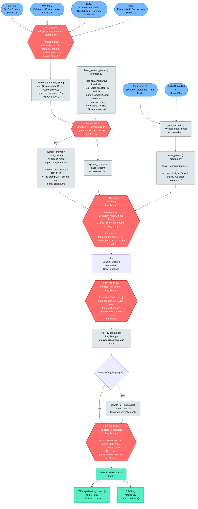

# Promptflow: SensAI Experiment Pipeline

This document visualises the full data flow from user input to LLM response,
including the **DPP branch** (Driver Personality Profile = Big Five + DBQ + BSSS + ERQ)
and an analysis of why the DPP currently has little or no measurable effect on the LLM output.

---

## 1. Full Promptflow



---

## 2. Die 4 Problemstellen — Warum DPP keinen Unterschied macht

| # | Wo im Code | Problem | Datei / Funktion |
|---|-----------|---------|-----------------|
| **1** | `build_persona_summary()` | Schwellenwert ist `≥ 4` (bzw. `≤ 2`). Bei **mittleren Scores** (2–3) wird **keine Persona-Regel** hinzugefügt — nur der `default`-Text. D.h. die meisten realen Teilnehmer bekommen identische Persona-Hints. | [prompts.py](prompts.py) |
| **2** | `_generate_llm_response()` | `Persona hints: ...` wird ans **Ende** des System Prompts angehängt, **nach** den harten Format-Constraints (`"exactly two short sentences"`). LLMs gewichten frühere Tokens stärker → Format-Regeln überschreiben Persona-Anpassungen. | [handlers.py](handlers.py) |
| **3** | `call_llm()` | `temperature=0.6` (Settings) erzeugt **deterministischere Outputs**. Bei niedriger Temperatur tendiert das Modell zur wahrscheinlichsten Antwort — unabhängig von Persona-Hints. Außerdem: `max_tokens=90` → sehr wenig Raum für Stil-Variation. | [llm_client.py](llm_client.py) / [settings.py](settings.py) |
| **4** | `truncate_response()` | Schneidet auf max. **2 Sätze / 30 Wörter / 280 Zeichen**. Selbst wenn das LLM personalisiert antwortet, werden Ton- und Stil-Unterschiede durch diesen Schritt **homogenisiert**. Auch `sanitize_llm_output()` filtert Formulierungen heraus, die Persona-typisch sein könnten. | [llm_client.py](llm_client.py) |

---

## 3. Comparison Table: Personalized vs. Non-Personalized

| Step | Non-Personalized | Personalized | Difference measurable? |
|------|-----------------|--------------|------------------------|
| `base_system_prompt()` | identical | identical | ❌ No |
| `+ Persona hints:` | not present | `persona_summary` string appended | ✅ Yes, in the prompt |
| `user_prompt()` | identical | identical | ❌ No |
| `chat_history` | separate stack per condition | separate stack per condition | ❌ No (both start empty) |
| `temperature=0.6` | identical | identical | ❌ Determinism suppresses differences |
| `max_tokens=90` | identical | identical | ❌ Little room for variation |
| `sanitize_llm_output()` | applied identically | applied identically | ❌ May strip persona-style phrasing |
| `truncate_response()` | max 2 sentences / 30 words | max 2 sentences / 30 words | ❌ **Eliminates remaining differences** |
| **Final response** | — | — | **Very similar or identical** |

---

## 4. Debug Suggestions: Making Pipeline Differences Visible

### 4.1 Log the prompt diff directly (partially already in place)

`_generate_llm_response()` in [handlers.py](handlers.py) already returns a `prompt_debug` string.
The UI displays it as "Debug-Prompt". Check there whether the system prompts for both conditions
actually differ:

```
# Personalized system prompt (Auszug):
"...Answer directly, clearly, with proper grammar. Scenario context: [...] 
Persona hints: Speak calmly. Driver seems anxious; more reassurance needed. Big Five: O=3, C=4..."

# Non-Personalized system prompt (Auszug):
"...Answer directly, clearly, with proper grammar. Scenario context: [...]"
```

→ If the strings differ, the problem lies **in the LLM or the post-processing**, not in the prompt construction.

---

### 4.2 Raise temperature for testing

In [settings.py](settings.py), temporarily:

```python
# Before:
DEFAULT_TEMPERATURE = 0.6

# For testing:
DEFAULT_TEMPERATURE = 1.2   # higher variability → persona influence becomes visible
```

> **Warning:** For debug purposes only. At `temperature > 1.0` responses become less coherent.

---

### 4.3 Disable truncate_response()

In [handlers.py](handlers.py) inside `_generate_llm_response()`:

```python
# Before:
cleaned_response = truncate_response(cleaned_response, response_lang)

# Comment out for testing:
# cleaned_response = truncate_response(cleaned_response, response_lang)
```

→ Reveals whether the LLM actually produces **longer / differently-toned** responses for `personalized`
before they are cut off.

---

### 4.4 Print persona summary for all score ranges

In [prompts.py](prompts.py) — `build_persona_summary()` — test whether the threshold actually fires:

```python
# Debug: what is generated for typical mid-range values (all = 3)?
from prompts import build_persona_summary
summary = build_persona_summary(3, 3, 3, 3, 3, 3, 3, 3, 3, 3, 3, 3, 4, 3, "de")
print(repr(summary))
# Expected result: only default rule + numbers → no persona-specific content!
```

---

### 4.5 Move persona hints to the beginning of the system prompt

In [handlers.py](handlers.py) inside `_generate_llm_response()`:

```python
# Current (hints at the end):
system_prompt = f"{base_system} Persona hints: {persona_summary}"

# Experiment (hints at the start — weighted more heavily by the LLM):
system_prompt = f"Persona hints: {persona_summary}\n\n{base_system}"
```

→ Tests whether the **position of the hints** in the prompt produces a measurable difference.
