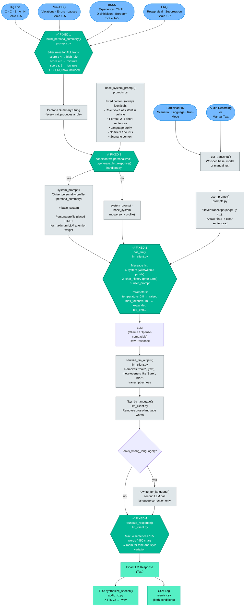

# Promptflow: SensAI Experiment Pipeline

This document visualises the full data flow from user input to LLM response,
including the **DPP branch** (Driver Personality Profile = Big Five + DBQ + BSSS + ERQ).

**Status:** All four original bottlenecks have been fixed. See section 2 for details.

---

## 1. Full Promptflow



---

## 2. Die 4 Problemstellen — Warum DPP keinen Unterschied macht

| # | Wo im Code | Problem | Datei / Funktion |
|---|-----------|---------|-----------------|
| **1** | `build_persona_summary()` | Schwellenwert ist `≥ 4` (bzw. `≤ 2`). Bei **mittleren Scores** (2–3) wird **keine Persona-Regel** hinzugefügt — nur der `default`-Text. D.h. die meisten realen Teilnehmer bekommen identische Persona-Hints. | [prompts.py](prompts.py) |
| **2** | `_generate_llm_response()` | `Persona hints: ...` wird ans **Ende** des System Prompts angehängt, **nach** den harten Format-Constraints (`"exactly two short sentences"`). LLMs gewichten frühere Tokens stärker → Format-Regeln überschreiben Persona-Anpassungen. | [handlers.py](handlers.py) |
| **3** | `call_llm()` | `temperature=0.6` (Settings) erzeugt **deterministischere Outputs**. Bei niedriger Temperatur tendiert das Modell zur wahrscheinlichsten Antwort — unabhängig von Persona-Hints. Außerdem: `max_tokens=90` → sehr wenig Raum für Stil-Variation. | [llm_client.py](llm_client.py) / [settings.py](settings.py) |
| **4** | `truncate_response()` | Schneidet auf max. **2 Sätze / 30 Wörter / 280 Zeichen**. Selbst wenn das LLM personalisiert antwortet, werden Ton- und Stil-Unterschiede durch diesen Schritt **homogenisiert**. Auch `sanitize_llm_output()` filtert Formulierungen heraus, die Persona-typisch sein könnten. | [llm_client.py](llm_client.py) |

---

## 3. Comparison Table: Personalized vs. Non-Personalized (After Fixes)

| Step | Non-Personalized | Personalized | Difference measurable? |
|------|-----------------|--------------|------------------------|
| `base_system_prompt()` | identical | identical | ❌ No |
| DPP profile block | not present | `"Driver personality profile:\n{summary}"` prepended | ✅ **Yes — at the top** |
| `user_prompt()` | identical | identical | ❌ No |
| `chat_history` | separate stack per condition | separate stack per condition | ❌ No (both start empty) |
| `temperature=0.8` | identical | identical | ✅ Higher variability → profile has more impact |
| `max_tokens=140` | identical | identical | ✅ Enough room for 2–4 varied sentences |
| `sanitize_llm_output()` | applied identically | applied identically | Neutral |
| `truncate_response()` | max 4 sentences / 55 words | max 4 sentences / 55 words | ✅ No longer clips persona-driven style |
| **Final response** | — | — | **Should differ noticeably in tone, phrasing and emphasis** |

---

## 4. Personality → Response Behaviour Reference

How each DPP trait should now shape the LLM response:

| Trait | Low (≤2) | Mid (3) | High (≥4, ERQ ≥5) |
|-------|----------|---------|-------------------|
| **O** Openness | Familiar, conventional advice only | One practical option mentioned | Offer alternative framing or creative reframe |
| **C** Conscientiousness | Single immediate step, no multi-part | One clear action | Precise, structured, acknowledge planning |
| **E** Extraversion | Minimal, calm, non-intrusive | Friendly but brief | Warm, conversational, brief encouragement |
| **A** Agreeableness | Direct, factual, emphasize benefit | Neutral helpful | Inclusive, gentle, "we"-framing |
| **N** Neuroticism | Skip reassurance, direct advice | One brief reassuring phrase first | Acknowledge stress first, heavy reassurance |
| **DBQ Violations** | No safety emphasis | Brief safety reminder | Explicit legal/safety warning |
| **DBQ Errors** | Standard | Clear simple instruction | Step-by-step, unambiguous |
| **DBQ Lapses** | Standard | Single focus point | Very simple, possible key-point repeat |
| **BSSS Experience** | Conventional | One option mentioned | Frame as enriching, safe option |
| **BSSS Thrill** | Affirm caution | Gentle caution, acknowledge feeling | Redirect to safe alternative |
| **BSSS Disinhibition** | Standard | Brief grounding phrase | Stress restraint + immediate safe step |
| **BSSS Boredom** | Standard | Acknowledge monotony, light distraction | Engaging tone + suggest music/podcast |
| **ERQ Reappraisal** | Direct practical help only | Gentle reframe offered | Actively suggest positive reinterpretation |
| **ERQ Suppression** | Standard | Light acknowledgment before advice | Acknowledge emotional state first, then advise |

---

## 5. Validation Snippet

Run this in the project directory to check the persona summary is now non-trivial for mid-range scores:

```python
import sys; sys.path.insert(0, '.')
from prompts import build_persona_summary

# All mid-range — should now produce rules for every trait:
summary = build_persona_summary(3, 3, 3, 3, 3, 3, 3, 3, 3, 3, 3, 3, 4, 3, "en")
print(summary)

# High N, low C — should produce heavy reassurance + single-step instruction:
summary2 = build_persona_summary(3, 1, 3, 3, 5, 2, 3, 3, 3, 3, 3, 3, 3, 3, "en")
print(summary2)
```
