# Promptflow: SensAI Experiment Pipeline

Dieses Dokument visualisiert den vollständigen Datenfluss vom Nutzer-Input bis zur LLM-Antwort,
inklusive der **DPP-Verzweigung** (Driver Personality Profile = Big Five + DBQ + BSSS + ERQ)
und einer Analyse, warum der DPP-Einfluss auf die LLM-Antwort derzeit gering oder nicht messbar ist.

---

## 1. Vollständiger Promptflow

```mermaid
flowchart TD
    %% ── Eingaben ───────────────────────────────────────────────
    A1([Participant ID\nScenario-Auswahl\nSprache / Run-Mode])
    A2([Big Five\nO · C · E · A · N\nSkala 1–5])
    A3([Mini-DBQ\nViolations · Errors · Lapses\nSkala 1–5])
    A4([BSSS\nExperience · Thrill · Disinhibition · Boredom\nSkala 1–5])
    A5([ERQ\nReappraisal · Suppression\nSkala 1–7])
    A6([Audio-Aufnahme\noder\nManualtext])

    %% ── Transkription ──────────────────────────────────────────
    B1["_get_transcript()\nWhisper 'base'-Modell\noder manueller Text"]

    %% ──  DPP → Persona Summary ─────────────────────────────────
    C1{{"⚠️ PROBLEM 1\nbuild_persona_summary()\nprompts.py\n\nSchwellenwert-Logik:\nRegel wird NUR hinzugefügt\nwenn Score ≥ 4 (oder ≤ 2)\n→ bei mittleren Werten\nbleibt nur 'default'-Regel!"}}
    C2["Persona-Summary-String\nz.B. 'Speak calmly. Driver seems anxious;\nmore reassurance... Big Five: O=3, C=4...'"]

    %% ── System Prompt ──────────────────────────────────────────
    D1["base_system_prompt()\nprompts.py\n\nFester Inhalt (immer gleich):\n• Rolle: Sprachassistent im Fahrzeug\n• Format: genau 2 kurze Sätze\n• Sprachreinheit\n• Kein Filler / keine Listen\n• Szenario-Kontext"]

    %% ── Condition-Verzweigung ───────────────────────────────────
    D2{{"⚠️ PROBLEM 2\ncondition == 'personalized'?\n_generate_llm_response()\nhandlers.py"}};

    D3["system_prompt =\nbase_system\n+ ' Persona hints: '\n+ persona_summary\n\n→ Persona-Hints stehen AM ENDE\ndes Prompts, NACH den harten\nFormat-Constraints"]
    D4["system_prompt =\nbase_system\n(keine Persona-Hints)"]
    D5["user_prompt()\nprompts.py\n\n'Driver transcript (lang=...): {...}.\nAnswer strictly in English,\nexactly two clear sentences.'"]

    %% ── Message-Liste → LLM ─────────────────────────────────────
    E1{{"⚠️ PROBLEM 3\ncall_llm()\nllm_client.py\n\nMessage-Liste:\n1. system (mit/ohne Hints)\n2. chat_history (prior turns)\n3. user_prompt\n\nParameter:\ntemperature=0.6  ← niedrig!\nmax_tokens=90    ← eng!\ntop_p=0.9"}}
    E2["LLM\n(Ollama / OpenAI-kompatibel)\nRohe Antwort"]

    %% ── Post-Processing ─────────────────────────────────────────
    F1{{"⚠️ PROBLEM 4\nsanitize_llm_output()\nllm_client.py\n\nEntfernt: *bold*, [text],\nMeta-Opener wie 'Sure:', 'Klar:',\nTranskript-Echos\n→ könnte Persona-typische\nFormulierungen entfernen"}}
    F2["filter_by_language()\nllm_client.py\nEntfernt fremdsprachige Wörter"]
    F3{"looks_wrong_language()?"}
    F4["rewrite_for_language()\nnochmaliger LLM-Call\nnur zur Sprachkorrektur"]
    F5{{"⚠️ PROBLEM 4b\ntruncate_response()\nllm_client.py\n\nMax: 2 Sätze / 30 Wörter / 280 Zeichen\n→ Ton- und Stil-Unterschiede\n(die DPP erzeugt) werden hier\nweggeschnitten!"}}

    %% ── Output ──────────────────────────────────────────────────
    G1["Finale LLM-Antwort\n(Text)"]
    G2["TTS: synthesize_speech()\naudio_io.py\nXTTS v2 → .wav"]
    G3["CSV-Log\nresults.csv\n(beide Conditions)"]

    %% ── Verbindungen ────────────────────────────────────────────
    A1 --> B1
    A6 --> B1
    A2 & A3 & A4 & A5 --> C1
    B1 --> D5
    C1 --> C2
    C2 --> D2
    D1 --> D2
    D2 -- "ja" --> D3
    D2 -- "nein" --> D4
    D3 & D4 --> E1
    D5 --> E1
    E1 --> E2
    E2 --> F1
    F1 --> F2
    F2 --> F3
    F3 -- "ja" --> F4
    F3 -- "nein" --> F5
    F4 --> F5
    F5 --> G1
    G1 --> G2
    G1 --> G3

    %% ── Styling ─────────────────────────────────────────────────
    classDef problem fill:#ff6b6b,color:#fff,stroke:#c0392b,stroke-width:2px
    classDef input fill:#74b9ff,color:#000,stroke:#0984e3,stroke-width:1px
    classDef process fill:#dfe6e9,color:#000,stroke:#636e72,stroke-width:1px
    classDef output fill:#55efc4,color:#000,stroke:#00b894,stroke-width:1px

    class C1,D2,E1,F1,F5 problem
    class A1,A2,A3,A4,A5,A6 input
    class B1,C2,D1,D3,D4,D5,F2,F4 process
    class G1,G2,G3 output
```



---

## 2. Die 4 Problemstellen — Warum DPP keinen Unterschied macht

| # | Wo im Code | Problem | Datei / Funktion |
|---|-----------|---------|-----------------|
| **1** | `build_persona_summary()` | Schwellenwert ist `≥ 4` (bzw. `≤ 2`). Bei **mittleren Scores** (2–3) wird **keine Persona-Regel** hinzugefügt — nur der `default`-Text. D.h. die meisten realen Teilnehmer bekommen identische Persona-Hints. | [prompts.py](prompts.py) |
| **2** | `_generate_llm_response()` | `Persona hints: ...` wird ans **Ende** des System Prompts angehängt, **nach** den harten Format-Constraints (`"exactly two short sentences"`). LLMs gewichten frühere Tokens stärker → Format-Regeln überschreiben Persona-Anpassungen. | [handlers.py](handlers.py) |
| **3** | `call_llm()` | `temperature=0.6` (Settings) erzeugt **deterministischere Outputs**. Bei niedriger Temperatur tendiert das Modell zur wahrscheinlichsten Antwort — unabhängig von Persona-Hints. Außerdem: `max_tokens=90` → sehr wenig Raum für Stil-Variation. | [llm_client.py](llm_client.py) / [settings.py](settings.py) |
| **4** | `truncate_response()` | Schneidet auf max. **2 Sätze / 30 Wörter / 280 Zeichen**. Selbst wenn das LLM personalisiert antwortet, werden Ton- und Stil-Unterschiede durch diesen Schritt **homogenisiert**. Auch `sanitize_llm_output()` filtert Formulierungen heraus, die Persona-typisch sein könnten. | [llm_client.py](llm_client.py) |

---

## 3. Vergleichstabelle: Personalized vs. Non-Personalized

| Schritt | Non-Personalized | Personalized | Ist Unterschied messbar? |
|--------|-----------------|--------------|--------------------------|
| `base_system_prompt()` | identisch | identisch | ❌ Nein |
| `+ Persona hints:` | nicht vorhanden | `persona_summary`-String angehängt | ✅ Im Prompt ja |
| `user_prompt()` | identisch | identisch | ❌ Nein |
| `chat_history` | separater Stack per Condition | separater Stack per Condition | ❌ Nein (beide starten leer) |
| `temperature=0.6` | identisch | identisch | ❌  Determinismus dämpft Unterschiede |
| `max_tokens=90` | identisch | identisch | ❌ Wenig Raum für Variation |
| `sanitize_llm_output()` | identisch angewendet | identisch angewendet | ❌ Filtert ggf. Persona-Stil weg |
| `truncate_response()` | max. 2 Sätze / 30 W | max. 2 Sätze / 30 W | ❌ **Eliminiert verbleibende Unterschiede** |
| **Finale Antwort** | — | — | **Sehr ähnlich bis identisch** |

---

## 4. Debug-Vorschläge: Pipeline-Unterschiede sichtbar machen

### 4.1 Prompt-Diff direkt loggen (bereits teilweise vorhanden)

In [handlers.py](handlers.py) gibt `_generate_llm_response()` bereits einen `prompt_debug`-String zurück.
In der UI wird er als "Debug-Prompt" angezeigt. Prüfe dort für beide Conditions ob sich die System Prompts
tatsächlich unterscheiden:

```
# Personalized system prompt (Auszug):
"...Answer directly, clearly, with proper grammar. Scenario context: [...] 
Persona hints: Speak calmly. Driver seems anxious; more reassurance needed. Big Five: O=3, C=4..."

# Non-Personalized system prompt (Auszug):
"...Answer directly, clearly, with proper grammar. Scenario context: [...]"
```

→ Wenn sich die Strings unterscheiden, liegt das Problem **im LLM oder im Post-Processing**, nicht beim Prompt-Bau.

---

### 4.2 Temperatur erhöhen zum Testen

In [settings.py](settings.py), temporär:

```python
# Vorher:
DEFAULT_TEMPERATURE = 0.6

# Zum Testen:
DEFAULT_TEMPERATURE = 1.2   # höhere Variabilität → Persona-Einfluss wird sichtbarer
```

> **Achtung:** Nur für Debug-Zwecke. Bei `temperature > 1.0` wird die Antwort inkohärenter.

---

### 4.3 truncate_response() deaktivieren

In [handlers.py](handlers.py) in `_generate_llm_response()`:

```python
# Vorher:
cleaned_response = truncate_response(cleaned_response, response_lang)

# Zum Testen auskommentieren:
# cleaned_response = truncate_response(cleaned_response, response_lang)
```

→ Zeigt ob das LLM bei `personalized` wirklich **längere / anders-tonige** Antworten produziert,
bevor sie abgeschnitten werden.

---

### 4.4 Persona-Summary für alle Score-Bereiche ausgeben

In [prompts.py](prompts.py) — `build_persona_summary()` — testet ob Schwellenwert greift:

```python
# Debug: Was wird bei typischen Werten (alle = 3) erzeugt?
from prompts import build_persona_summary
summary = build_persona_summary(3, 3, 3, 3, 3, 3, 3, 3, 3, 3, 3, 3, 4, 3, "de")
print(repr(summary))
# Erwartetes Ergebnis: Nur default-Regel + Zahlen → kein Persona-spezifischer Inhalt!
```

---

### 4.5 Persona hints an den Anfang des System Prompts stellen

In [handlers.py](handlers.py) in `_generate_llm_response()`:

```python
# Aktuell (Hints am Ende):
system_prompt = f"{base_system} Persona hints: {persona_summary}"

# Experiment (Hints am Anfang — höhere Gewichtung durch LLM):
system_prompt = f"Persona hints: {persona_summary}\n\n{base_system}"
```

→ Testet ob die **Position der Hints** im Prompt einen messbaren Unterschied erzeugt.
