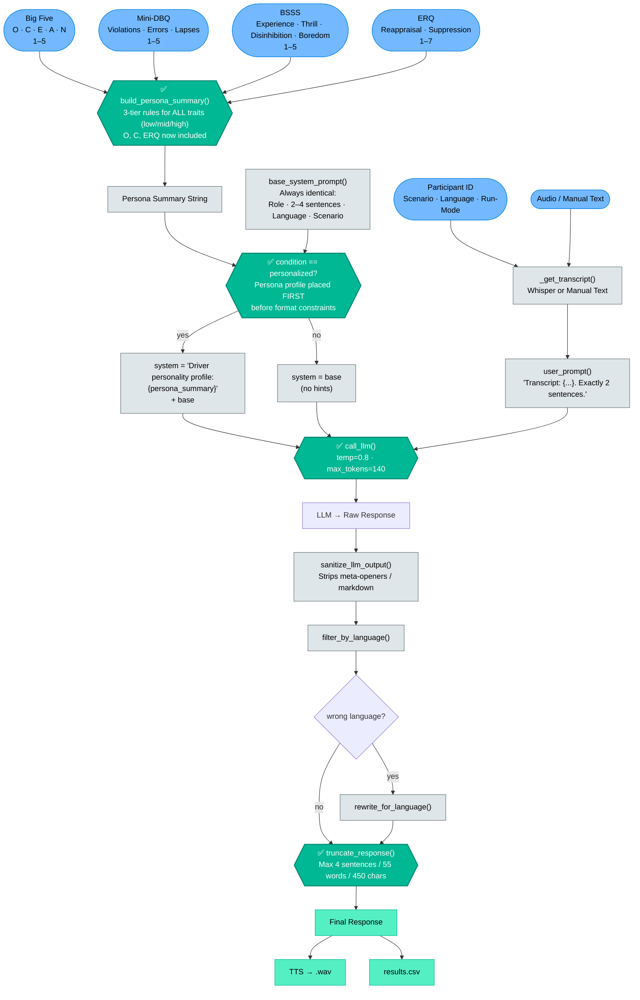

# Audio Personality Prompting Prototype

**University research project** investigating whether large language models generate more appropriate responses when provided with personality trait information.

## Research Context

This application enables controlled experiments comparing LLM-generated responses in driving scenarios under two conditions:

1. **Personalized (Experimental):** LLM receives personality profile (Big Five, driving behavior, sensation seeking, emotion regulation)
2. **Baseline (Control):** LLM operates without personality context

**Research Question:** Do personality-informed prompts lead to more contextually appropriate, safer, and user-aligned responses in high-stakes scenarios (e.g., time pressure while driving)?

**Key Metrics:**
- Response appropriateness for different personality types
- Safety emphasis based on risk profiles (DBQ violations/lapses)
- Engagement strategies for boredom-susceptible users
- Emotional tone matching (neuroticism, agreeableness)

---

## Features

- 🎤 **Voice input** with Whisper transcription
- 🤖 **Dual-mode LLM generation** (personalized/baseline)
- 🔊 **Text-to-speech** with Coqui XTTS v2
- 🌍 **Bilingual support** (English/German)
- 📊 **Personality-based prompt adaptation** (Big Five, DBQ, BSSS, ERQ)
- 💾 **CSV export** for research data analysis
- 🎯 **Scenario-based testing** (job interviews, exams under time pressure)

---

## Demo Video

Walkthrough of the Gradio interface and full interaction flow: `video/SensAI_Demo.mp4`

---

## Personality Framework

The application uses validated psychological scales to construct driver personas:

### Big Five Personality Traits (1-5)
- **Openness (O):** Influences receptiveness to novel suggestions
- **Conscientiousness (C):** Affects planning and rule-following
- **Extraversion (E):** Determines social interaction preferences
- **Agreeableness (A):** Shapes conflict resolution and cooperation
- **Neuroticism (N):** Impacts anxiety and stress responses

### Driver Behavior Questionnaire (DBQ) (1-5)
- **Violations:** Deliberate rule-breaking tendencies
- **Errors:** Skill-based mistakes frequency
- **Lapses:** Attention/memory failures

### Brief Sensation Seeking Scale (BSSS) (1-5)
- **Experience Seeking:** Desire for novel experiences
- **Thrill & Adventure:** Risk-taking inclination
- **Disinhibition:** Impulsivity level
- **Boredom Susceptibility:** Monotony tolerance

### Emotion Regulation Questionnaire (ERQ) (1-7)
- **Cognitive Reappraisal:** Ability to reframe situations
- **Expressive Suppression:** Emotional control strategy

**Prompt Adaptation Example:**
- High Neuroticism + High DBQ Lapses → Extra reassurance, simple instructions, stress acknowledgment
- High Boredom Susceptibility → Engaging suggestions (music/podcasts) while maintaining safety focus
- High DBQ Violations → Emphasis on legal consequences and safety compliance

---

## Prompt Pipeline (DPP Flow)

Full pipeline from driver personality inputs to LLM response.
Red nodes mark the four points where the DPP currently has little effect on the output.
For the detailed analysis and debug suggestions see [PROMPTFLOW.md](PROMPTFLOW.md).



---

## Quick Start

### Requirements
- **Python 3.11**
- **LLM Server:** Ollama (recommended) or any OpenAI-compatible API
- **Microphone** for audio input
- **Network access** for model downloads (~2GB first run)

### Installation

**macOS/Linux:**
```bash
git clone <repo> prototype_audio_test
cd prototype_audio_test
python3.11 -m venv .venv
source .venv/bin/activate
pip install -r requirements.txt
```

**Windows (PowerShell):**
```powershell
git clone <repo> prototype_audio_test
cd prototype_audio_test
py -3.11 -m venv .venv
.venv\Scripts\Activate.ps1
pip install -r requirements.txt
```

> **Note:** Ollama officially supports macOS/Linux. Windows users should use WSL or another OpenAI-compatible endpoint.

### LLM Server Setup

**Option A: Ollama (Recommended)**
```bash
# Start Ollama server (keep terminal open)
ollama serve

# Pull model (in separate terminal)
ollama pull llama2:7b-chat
```
Default settings: `http://localhost:11434` endpoint, `llama2:7b-chat` model

**Option B: llama.cpp Server**
```bash
python -m venv ~/.llama-venv && source ~/.llama-venv/bin/activate
pip install llama-cpp-python
python -m llama_cpp.server \
  --model /path/to/model.gguf \
  --host 0.0.0.0 --port 8000 \
  --n_ctx 4096 --chat_format llama-2
```
Configure UI: `http://localhost:8000` endpoint, model name to match

### Running the Application

```bash
source .venv/bin/activate  # Windows: .venv\Scripts\Activate.ps1
python app.py
```

Open the Gradio URL (printed in terminal) in your browser.

---

## Usage Workflow

### 1. Initial Setup
- Click **"Warmup starten"** to preload models (1-2 min first time)
- Click **"LLM Verbindung testen"** to verify connection

### 2. Configure Experiment
- **Participant ID:** Unique identifier for this session
- **Scenario:** Select driving situation from dropdown
- **Language:** Toggle between English/German (affects LLM and TTS)
- **Personality Scales:** Adjust Big Five, DBQ, BSSS, ERQ sliders
- **Response Mode:** 
  - Both: Compare personalized vs. baseline
  - Personalized only: Persona-adapted responses
  - Non-personalized only: Baseline responses

### 3. Interact
- **Audio input:** Click mic button, speak, click again to stop
- **Text input:** Type directly if mic unavailable
- Click **"Generate response(s)"** → receive LLM reply with TTS audio

### 4. Save Data
- Click **"Save Condition 1/2"** to append results to `results.csv`
- Use **"Trigger Check-in"** for periodic engagement questions

---

## Project Structure

```
prototype_audio_test/
├── app.py                  # Gradio UI and main entry point
├── handlers.py             # Core orchestration (LLM, TTS, state)
├── prompts.py              # Prompt engineering and persona logic
├── llm_client.py           # OpenAI/Ollama API client
├── audio_io.py             # Whisper (STT) and XTTS (TTS)
├── data.py                 # JSON config loaders
├── settings.py             # Configuration constants
├── requirements.txt        # Pinned dependencies
├── scenarios.json          # Driving scenarios (en/de)
├── persona_rules.json      # Personality → instruction mappings
├── results.csv             # Saved experiment data
└── tmp_audio/              # Temporary TTS/input files
```

---

## Configuration

### Environment Variables
```bash
export TTS_SPEAKER_NAME="female_speaker"  # Override default TTS voice
export TTS_SPEAKER_WAV="/path/to/voice.wav"  # Custom voice clone
```

### Editing Defaults (`settings.py`)
```python
DEFAULT_ENDPOINT = "http://localhost:11434"
DEFAULT_MODEL = "llama2:7b-chat"
MAX_GENERATION_TOKENS = 90
DEFAULT_TEMPERATURE = 0.6
```

### Adding Scenarios (`scenarios.json`)
```json
{
  "id": "unique_scenario_id",
  "title": "Display Name",
  "text": "English 2nd-person scenario text",
  "text_de": "German scenario text"
}
```

---

## Troubleshooting

| Issue | Solution |
|-------|----------|
| **Ollama 404 error** | Model name must exactly match `ollama list` output |
| **TTS BeamSearchScorer error** | `pip install "transformers<4.46"` (already in requirements.txt) |
| **TTS weights_only error** | `pip install torch==2.5.1 torchaudio==2.5.1` (already pinned) |
| **Slow first response** | Expected - XTTS downloads ~1GB on first run. Use warmup. |
| **No LLM reply** | Check endpoint/port. For llama.cpp use `--chat_format llama-2` |
| **Gradio errors** | Ensure Gradio 6.0+ installed: `pip install --upgrade gradio` |

### Clear Audio Cache
```bash
# macOS/Linux
rm tmp_audio/*

# Windows PowerShell
del tmp_audio\*
```

---

## Architecture



---

## Development

### Type Checking
```bash
pip install mypy types-requests
mypy --strict audio_io.py handlers.py llm_client.py data.py
```

## Data Export

Results are saved to `results.csv` with columns:
- Timestamps, participant ID, scenario ID
- Personality scores (Big Five, DBQ, BSSS, ERQ)
- Condition (personalized/non-personalized)
- Driver transcript, LLM response, latency

**Privacy Note:** Audio files in `tmp_audio/` are temporary. Transcripts are saved in CSV.

---

## Deutsche Kurzfassung

**Gradio-App** zum Vergleich von LLM-Antworten mit/ohne Persona-Hinweise.

### Setup
```bash
python3.11 -m venv .venv
source .venv/bin/activate
pip install -r requirements.txt
```

### LLM-Server
```bash
ollama serve
ollama pull llama2:7b-chat
```

### Starten
```bash
python app.py  # URL im Browser öffnen
```

### Nutzung
1. Warmup + LLM-Test durchführen
2. ID, Szenario, Sprache (de/en) wählen
3. Persönlichkeits-Slider einstellen
4. Audio/Text eingeben → **Antwort generieren**
5. Optional: Ergebnisse speichern

**Dateien:** `results.csv` (Daten), `tmp_audio/` (temporär), `scenarios.json` + `persona_rules.json` (Konfiguration)

**Troubleshooting:** Siehe englische Tabelle oben.
